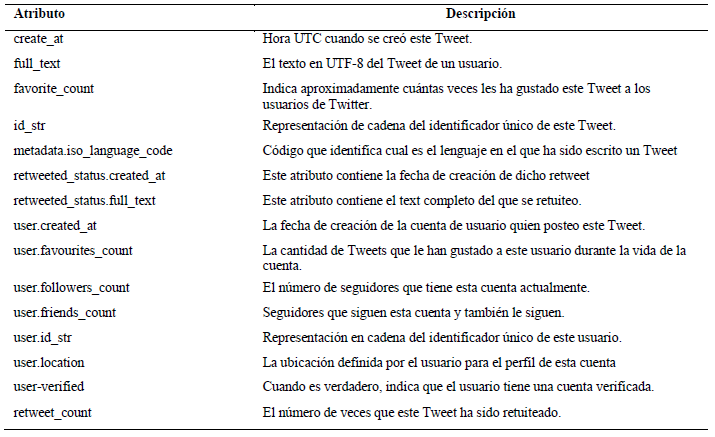
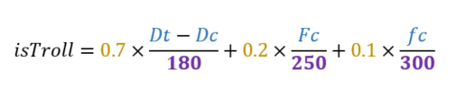
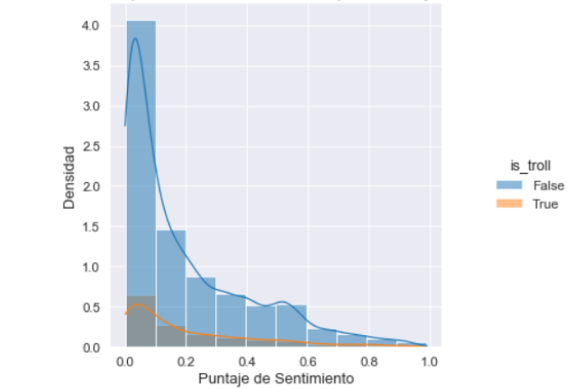
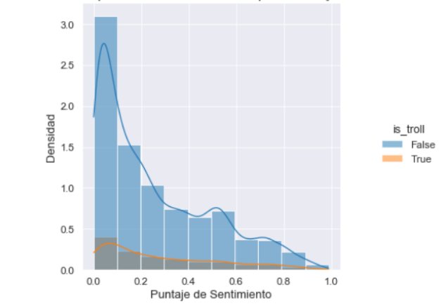
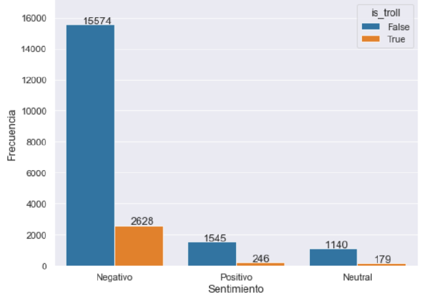
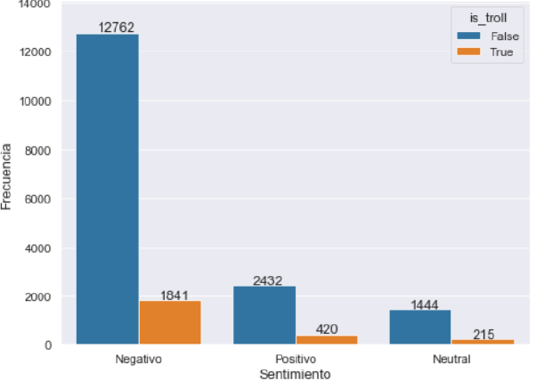
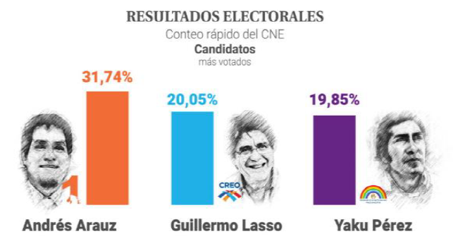
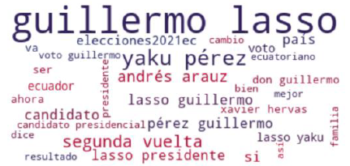
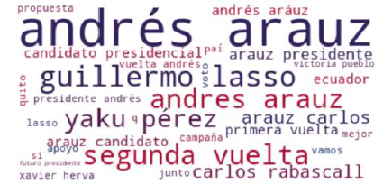
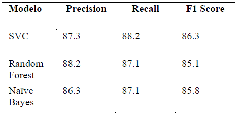

<!-- REPOSITORY TITLE-->
<h1 align="center">
    <strong>SentimentAnalysisEcuador2021</strong>
</h1>
<h5 align="center">
    <center> Miguel Angel Macias, Jonnathan Campoberde <br/> 
    <i>Universidad de Cuenca <br/>  Facultad de Ingenieria - Escuela de Sistemas<br/> Cuenca, Ecuador</i>
    <br/> { mangel.maciasn, jonnathan.campoberde }@ucuenca.edu.ec</center>
</h5>
<br>
<!-- SHORT DESCRIPTION-->
<p align="center"><i> 
     Sentiment Analysis application for the presidential elections Ecuador 2021 using Twitter API
</i></p>
<!-- BADGE SHIELDS -->
<div align="center">
    <a href="https://github.com/TheWorstOne/SentimentAnalysisEcuador2021/stargazers"></a>
    <a href="https://github.com/TheWorstOne/SentimentAnalysisEcuador2021/network/members"></a>
    <a href="https://github.com/TheWorstOne/SentimentAnalysisEcuador2021/pulls"></a>
    <a href="https://github.com/TheWorstOne/SentimentAnalysisEcuador2021/issues"></a>
    <a href="https://github.com/TheWorstOne/SentimentAnalysisEcuador2021/graphs/contributors"></a>
</div>
<br>
<p align="center"><i>Interested in the project? Please visit my <a href="https://github.com/TheWorstOne/">website</a></i></p>
<br>

<!-- ABOUT THE PROJECT -->
The Sentiment Analysis allows us to detect the polarity of the discussions that take place on Twitter, a particular case is politics. The tweets that were collected deal with the two presidential candidates leading the polls for the `Ecuador 2021` elections. The two candidates, **Andrés Arauz and Guillermo Lasso**, belong to the two most dominant political movements in the Ecuadorian state. The objective of this article is the Sentiment Analysis of these two candidates and then contrast them with the official results of the elections, as well as to train a model for classifying the sentiments of the tweets. The results obtained show that the reality in social networks is different and can serve as an indicator of satisfaction of the people towards the candidates, but not as a definitive predictor for the results of the elections.

<p align="center">
    
    <br>
    <em>Image taken from an <a href="https://www.ecuavisa.com/articulo/elecciones-2021/educacion-electoral/697581-segunda-vuelta-redes-mas-ficcion-que-realidad?fbclid=IwAR3vJDRQYT9U3nNn1bZJBSyDyTkW2Bp3RFlkQGUyZ8moSXSlg-sUbgkcP3U" target='_blank'>Ecuavisa news article</a>. Art: Jhosue Vite.</em>
</p>

<br>

If you like this Repo, Please click the :star:

<!-- TABLE OF CONTENTS -->
## **Contents**
  - [Research Questions](#research-questions)
  - [Dataset Description](#dataset-description)
  - [Methodology](#methodology)
  - [Results](#results)
  - [Conclusions](#conclusions)
  - [Contact](#contact)
  - [Acknowledgements](#acknowledgements)

  <!-- Introduction -->
## **Research Questions**

* __RQ1__: How accurate does Twitter data reflect political sentiment in an electoral process?
* __RQ2__: How accepted are the candidates within the social network Twitter?
* __RQ3__: Are the official results similar to the results found in our analysis?

<!-- Dataset Description -->
## **Dataset Description**

For the elaboration of the [dataset](https://www.kaggle.com/theworstone/sentimentanalysisecuador2021), the tweets were collected before and after the electoral elections, that is, from `January 24 to February 6` of this year and from `February 8 to February 13`. In total, around __326,389__ tweets were obtained from both candidates, 202,320 only for candidate Andrés Arauz and 124,069 for candidate Guillermo Lasso. The extraction of the tweets was carried out using the Twitter API and also the Python Tweepy library

<p align="center">
    
    <br>
    <em>Description of the characteristics of the dataset.</em>
</p><br>

### **Twitter Search Query**
To collect the data, those tweets that belong to Spanish and that have the full text were filtered; A keyword search was used for each candidate separately, words such as: `“Andrés Arauz, Andres Arauz, Arauz”`, and `“Guillermo Lasso, Lasso”`.

The script for the extraction of Tweets is located in the path `/src/data_extraction_save_mongoDB.py`. This script saves the tweets within a database in Mongodb, so you will have to configure the connection address. You must also include the API Key and the Twitter API access token.
```PYTHON
consumer_key        =   dataAPI['API key']
consumer_secret     =   dataAPI['API secret key']
access_token        =   dataAPI['Access token']
access_token_secret =   dataAPI['Access token secret']
```
### Dataset facility
If you don't want to rerun the scripts to collect the tweets you can use both datasets in our [Kaggle Dataset](https://www.kaggle.com/theworstone/sentimentanalysisecuador2021). The pre-election and post-election data have been merged into a single dataset for each candidate.

<!-- Methodology -->
## **Methodology**
### **Dataset preprocessing**
Political events and elections have disinformation campaigns attributed to sponsored actors. The group of people or entities that are behind the misinformation or opinion influence are known as trolls. The proposed metric to solve this problem has weight given the importance for the detection of trolls. The meaning of each value within the formula is the following Dt is the creation date of the Tweet and Dc is the creation date of the user's account, Fc is the number of followers, fc is the friends of a user, its meaning was expressed earlier. If the user has a validated account, this will be considered a real user and it is not necessary to use this formula.

<p align="center">
    
</p><br>

The selection threshold to know if a user is a troll is less than `0.8`, all values higher than this are considered valid tweets and are not discarded.

### **Sentiment Lexicon**
For the sentiment lexicon it was decided to label the feelings in 3 classes: `positive`, `negative` and `neutral`. This in order to obtain better results about the opinions that people deposit in the tweets about political candidates and to deal with possible imbalances in the dataset.
In this study we used a model already trained for labeling feelings in the Spanish language called, the [senty-py](https://github.com/aylliote/senti-py) library.

### **Sentiment Analysis**
After carrying out the sentiment lexicon phase and having a dataset already labeled with the emotions towards both candidates, an exploratory analysis is carried out in order to obtain more detail about the opinions.

### **Creation of a specific model for the labeling of Tweets in Ecuadorian politics**
The total amount of data available for training is 40424, so a partition of 80% for training and 20% for testing has been selected, equivalent to 32339 and 8085 tweets respectively.

<!-- Results -->
## **Results**
### **RQ1: How accurate does Twitter data reflect political sentiment in an electoral process?**
After applying the algorithm for detecting trolls proposed by the authors of this work, it was observed that about `13-14%` of the comments deposited in both candidates came from trolls accounts. Analyzing these percentages, we can see that trolls do not have a significant influence on social networks, which does not imply that all the opinions deposited in both political parties come from these accounts.
<p align="center">
    
    <br>
    <em>Fig 1. Sentiment polarity distribution for candidate Andrés Arauz</em>
</p><br>

In both Figures 1 and 2, a leptokurtic curve skewed to the left is observed in the sentiment score, which means that candidate Arauz received a greater number of negative comments on the social network Twitter. Similarly, a similar behavior can be seen towards candidate Guillermo Lasso.

<p align="center">
    
    <br>
    <em>Fig 2. Sentiment polarity distribution for candidate Guillermo Lasso</em>
</p><br>

### **RQ2: How accepted are the candidates within the social network Twitter?**
Figure 3 shows the imbalance that exists between the 3 kinds of feelings used for this study, where negative sentiment towards candidate Andrés Arauz predominates.

<p align="center">
    
    <br>
    <em>Fig 3. Sentiment polarity frequency for candidate Andrés Arauz</em>
</p><br>

A similar behavior towards the candidate Guillermo Lasso can be seen in Figure 4. This shows us that the degree of acceptance that exists in the social network Twitter by users is negative towards both candidates.

<p align="center">
    
    <br>
    <em>Fig 4. Sentiment polarity frequency for candidate Guillermo Lasso</em>
</p><br>

### **RQ3: Are the official results similar to the results found in our analysis?**
The official results of the elections presented by the Ecuadorian National Electoral Council in Figure 5, show us a `different reality from that observed in the results obtained in this work`.

<p align="center">
    
    <br>
    <em>Fig. 5. Official results by the CNE. Image taken from <a href="https://www.primicias.ec/noticias/politica/cne-empieza-primeros-resultados-oficiales/" target='_blank'>Primicias website</a></em>
</p><br>

Although in social networks there is a greater amount of negative feelings towards both candidates, the official results show us another side of reality. Finally, a word cloud analysis was performed for each candidate grouping them into positive and negative feelings. In Figure 6, you can see the words related to the `positive sentiment of the Lasso candidate`.

<p align="center">
    
    <br>
    <em>Fig 6. Word cloud of positive sentiment towards candidate Guillermo Lasso</em>
</p><br>

Words like `“segunda vuelta”` and `“yaku perez”` are common in both the positive and negative feelings of both candidates, see Figure 7.

<p align="center">
    
    <br>
    <em>Fig 7. Word cloud of positive sentiment towards candidate Andres Arauz</em>
</p><br>

### **Model training results for tagging Tweets**
The results obtained are shown in Figure 8, where it is observed that the three trained models offered good results, however the `SVC` had a better value in each of the metrics, making it the best model for the labeling of Tweets in Ecuadorian politics. 

<p align="center">
    
    <br>
    <em>Fig 8. Comparison of the metrics obtained for each trained model</em>
</p><br>

<!-- Conclusions -->
## **Conclusions**
The social network Twitter is the favorite place for users to discuss political movements or the future of the country.
For RQ1, it can be said that tweets do reflect the political sentiment of users within the social network, since the issue of trolls does not represent a major problem. <br>
In RQ2 it was possible to show that the degree of acceptance by users is negative towards both candidates, where an imbalance is observed between the 3 kinds of feelings. This is because `not all Ecuadorians are attracted to express their political position on social media`, perhaps due to a `lack of interest or the social pressure that it entails`. <br>
Then, in RQ3, the official results presented by the CNE could be compared with the results found in this article. Where it could be shown that the reality in social networks is different, and `can serve as an indicator of satisfaction of the people towards the candidates`, but `not as a definitive predictor` for the results of the elections.

<!-- CONTACT -->
## **Contact**

Miguel Ángel Macías - 👨‍💻[Linkedin](https://www.linkedin.com/in/mangelladen/)

My Personal Website: ✨[TBD](https://github.com/TheWorstOne/)


<!-- ACKNOWLEDGEMENTS -->
## **Acknowledgements**
* [Jonnathan Campoberde](https://github.com/JonnHenry) a good friend and the co-author of this study
* [aylliote](https://github.com/aylliote/senti-py) for the senti-py classifier tool in spanish

<br>

[![CC BY-SA 4.0][cc-by-sa-shield]][cc-by-sa]

This work is licensed under a
[Creative Commons Attribution-ShareAlike 4.0 International License][cc-by-sa].

[![CC BY-SA 4.0][cc-by-sa-image]][cc-by-sa]

[cc-by-sa]: http://creativecommons.org/licenses/by-sa/4.0/
[cc-by-sa-image]: https://licensebuttons.net/l/by-sa/4.0/88x31.png
[cc-by-sa-shield]: https://img.shields.io/badge/License-CC%20BY--SA%204.0-lightgrey.svg
